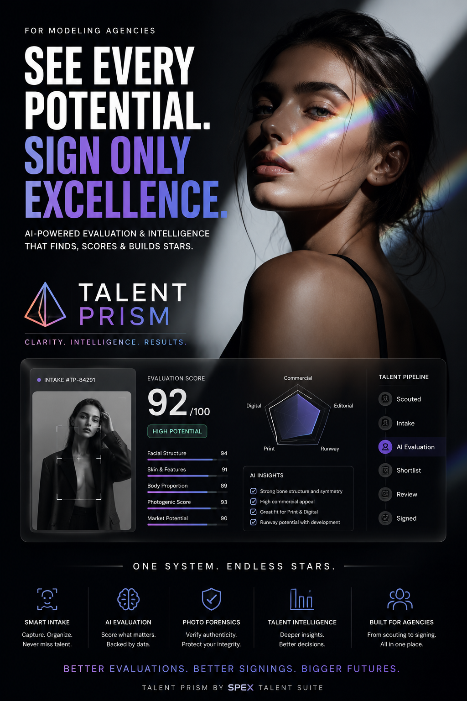

# SPeXecute Talent Prism OSR (MUST READ)

### An Open-Source Reference Implementation for AI-Assisted Applicant Intake and Evaluation for Talent Management Industry





> [!IMPORTANT]
> **Talent Prism OSR is an open-source reference implementation.** It demonstrates architectural patterns, workflow automation, and implementation techniques for building AI-assisted applicant intake and evaluation platforms. It is **not** production-ready software, a hosted service, or a commercially supported product. Every deployment is unique, and the organization deploying or modifying this repository is solely responsible for validating, securing, operating, maintaining, and supporting its implementation.

---

## Overview

Talent Prism demonstrates how organizations can build configurable, AI-assisted applicant intake and evaluation platforms using workflow automation, secure media storage, configurable organization logic, and modern multimodal AI.

Rather than being a complete recruitment platform, Talent Prism focuses on the technical foundation required to automate applicant processing while keeping recruiters in control of final hiring decisions.

The repository is designed for developers, software agencies, solution architects, AI engineers, and organizations interested in understanding how modern AI-assisted evaluation systems can be architected and implemented.

---

# Why Talent Prism?

Finding exceptional talent is difficult.

Recruiters often spend countless hours reviewing applications, organizing media, validating submissions, and performing repetitive administrative work before they can evaluate a candidate.

Talent Prism demonstrates how AI and workflow automation can reduce manual effort by:

- Standardizing applicant intake
- Automating validation
- Organizing applicant media
- Performing AI-assisted evaluations
- Generating structured candidate summaries
- Delivering applicants ready for recruiter review

The goal is not to replace recruiters.

The goal is to help recruiters spend more time evaluating people and less time managing processes.

---

# Architecture Overview

Talent Prism demonstrates a modular applicant processing pipeline.

```
Applicant

↓

Applicant Intake

↓

Validation

↓

Organization Configuration

↓

Secure Media Upload

↓

AI Photo Quality Assessment

↓

AI Candidate Analysis

↓

Structured Evaluation

↓

Recruiter Review
```

Every stage is documented throughout the repository.

---

# Core Features

The reference implementation includes:

### Applicant Intake

- HTTP webhook submissions
- Existing website integration
- Open call support
- Payload validation
- Duplicate detection
- Consent verification

---

### Configurable Organization Logic

Organizations can customize:

- AI prompts
- Evaluation criteria
- Qualification thresholds
- Markets
- Categories
- Submission requirements

without modifying workflow logic.

---

### Secure Media Storage

Demonstrates:

- Cloudflare R2
- Private media
- Signed URLs
- Automatic organization
- Secure access

---

### AI-Assisted Evaluation

Example workflows include:

- Photo quality assessment
- Candidate analysis
- Structured scoring
- AI summaries
- Organization-specific evaluation

---

### Workflow Automation

Built using n8n to demonstrate:

- Modular workflows
- Error handling
- Workflow chaining
- Scheduled maintenance
- Extensible automation

---

### Frontend Agnostic

Talent Prism integrates with virtually any frontend or existing platform.

Examples include:

- React
- Next.js
- Vue
- Angular
- Bubble
- FlutterFlow
- Retool
- Existing Talent Management Systems

---

# Repository Structure

```
Talent-Prism/

README.md

docs/

workflows/

worker/

examples/

assets/

LICENSE

DISCLAIMER.md

CONTRIBUTING.md

SECURITY.md

...
```

A detailed breakdown is available in the Documentation Index.

---

# Technologies

Reference implementation:

| Component | Technology |
|-----------|------------|
| Workflow Automation | n8n |
| Database | Supabase |
| Storage | Cloudflare R2 |
| Signed URLs | Cloudflare Workers |
| AI | Google Gemini |
| Configuration | Airtable |

These technologies are implementation choices—not architectural requirements.

See **Technology Alternatives** for compatible replacements.

---

# Documentation

Documentation is organized into dedicated sections.

- Introduction
- Architecture
- Configuration
- Workflow Automation
- Storage
- Cloudflare Workers
- Frontend Integration
- Frontend Reference
- Deployment
- Technology Stack

See:

```
docs/
```

---

# Who Is This Repository For?

Talent Prism is intended for:

- Software Engineers
- AI Engineers
- Solution Architects
- Technical Recruiters
- Software Agencies
- Talent Agencies
- Modeling Agencies
- Casting Organizations
- Businesses building AI-assisted recruitment solutions

---

# Who Is This Repository Not For?

Talent Prism OSR is **not**:

- A hosted SaaS
- A plug-and-play product
- A complete ATS
- A CRM
- An HR platform

Organizations should expect to customize the implementation for their own requirements.


---

# Open Calls

Public open calls can be supported by creating a frontend application form and submitting applicant data to the Intake Webhook.

No separate workflow is required.

The same applicant processing pipeline is reused regardless of whether applicants originate from:

- Public websites
- Partner agencies
- Internal recruiters
- Referrals
- Existing Talent Management Systems

---

# Reference Implementation Scope

Included:

- Applicant intake
- Validation
- Organization configuration
- Secure storage
- AI evaluation
- Workflow automation
- Frontend integration


# What This Repository Does Not Include

Talent Prism is a reference implementation focused on applicant intake, secure media storage, workflow automation, and AI-assisted evaluation.

The following capabilities are intentionally outside the scope of this repository and should be implemented according to each organization's operational requirements:

- Recruiter authentication
- User management
- Role-based permissions
- Internal messaging
- Calendar integration
- Interview scheduling
- Email notifications
- Client portals
- Talent CRM
- Billing
- Analytics dashboards
- Mobile applications
- Production deployment infrastructure

The included architecture is designed to support these capabilities without requiring changes to the core applicant processing workflows.

---

# Getting Started

1. Clone the repository.
2. Review the architecture documentation.
3. Configure your environment and setup the Supabase database.
4. Deploy the Cloudflare Worker.
5. Configure Cloudflare R2.
6. Import the n8n workflows.
7. Configure your organization settings.
8. Connect your frontend.
9. Submit a test applicant.

See the Deployment documentation for detailed instructions.

---

# Repository Philosophy

Talent Prism demonstrates **how** an AI-assisted applicant evaluation platform can be built—not the only way it should be built.

Every organization has unique workflows, infrastructure, compliance requirements, and operational processes.

This repository intentionally emphasizes:

- Modular architecture
- Vendor-agnostic design
- Configuration over customization
- Security by default
- Extensibility
- Documentation-first engineering

---

# Contributing

Contributions are welcome.

Please review:

- CONTRIBUTING.md
- CODE_OF_CONDUCT.md
- SECURITY.md

before submitting issues or pull requests.

---

# License

Talent Prism is released under the MIT License.

See:

LICENSE

---

# Disclaimer

Talent Prism is provided as an open-source reference implementation.

It is not production-ready software.

Organizations deploying or modifying this repository are solely responsible for:

- Infrastructure
- Security
- Compliance
- Operations
- AI configuration
- Production deployments

Please review:

DISCLAIMER.md

before using this repository.

---

# About

Talent Prism is developed and maintained by **Dev Tripathy AI Systems**.

Our goal is to share practical engineering knowledge through production-inspired reference implementations while helping organizations build modern AI-powered systems.

If your organization requires a custom implementation, workflow automation, AI integration, or consulting services, please visit our website or contact us to discuss your requirements.

---

## Star the Repository ⭐

If you found Talent Prism useful, consider starring the repository to support future development and open-source work.
