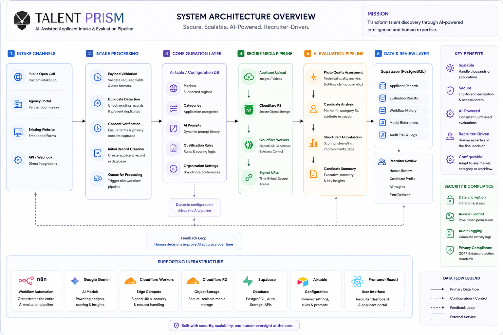

# Architecture Overview

Talent Prism follows a modular, workflow-driven architecture in which each component performs a single responsibility within the applicant processing pipeline.

Rather than relying on one large application, the system is composed of loosely coupled services that communicate through workflows, shared storage, and structured data.

This design enables organizations to extend, replace, or integrate individual components without redesigning the entire platform.

At a high level, the architecture consists of five primary layers:

## 1. Applicant Intake

Applications are submitted through an organization's preferred intake channels, such as:

- Public open calls
- Partner agencies
- Existing websites
- Custom application forms
- Internal submission systems

Each submission is validated before entering the processing pipeline.

---

## 2. Workflow Automation

n8n orchestrates the applicant lifecycle through a series of modular workflows responsible for:

- Request validation
- Organization configuration retrieval
- Consent verification
- Media processing
- AI evaluation
- Status updates
- Workflow coordination

Each workflow focuses on a single stage of processing, making the system easier to understand, maintain, and extend.

---

## 3. Secure Media Storage

Applicant photographs and supporting media are stored privately in Cloudflare R2.

Instead of exposing storage objects directly, Talent Prism generates time-limited signed URLs using a Cloudflare Worker, allowing authorized applications to securely access private media without making the storage bucket publicly accessible.

---

## 4. AI Evaluation

After validation and media processing, applicant data is evaluated using configurable AI prompts and organization-specific evaluation criteria.

Evaluation results may include:

- Photo quality assessment
- Structural analysis
- Category recommendations
- Confidence scores
- Organization-specific scoring
- Processing metadata

The evaluation methodology is configurable, allowing organizations to adapt the system to different markets, recruitment standards, and operational requirements.

---

## 5. Recruiter Review & Integration

Once evaluation is complete, structured results become available for recruiter review.

Organizations may:

- Display results in a dedicated frontend
- Synchronize data with an existing talent management system
- Export results to spreadsheets or databases
- Integrate with internal applications
- Build custom dashboards and reporting tools

Talent Prism intentionally remains frontend-agnostic, allowing organizations to adopt the user experience that best fits their existing workflows.

---

# Architectural Principles

The reference implementation is guided by several core principles:

### Modular by Design

Each component performs a single responsibility and can evolve independently.

### Configuration over Customization

Organization-specific behavior is driven through configuration rather than modifying application logic.

### Frontend Agnostic

The applicant processing pipeline is independent of any specific user interface or frontend framework.

### Integration First

Talent Prism is designed to complement existing operational systems rather than replace them.

### Security by Default

Private media remains protected through secure storage and temporary signed URLs.

### Extensible Architecture

Organizations can introduce additional workflows, integrations, dashboards, and business logic without changing the core applicant processing pipeline.